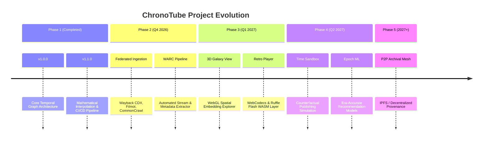

# 🗺️ ChronoTube Engine: Project Roadmap

This document outlines the strategic vision, milestones, and future feature developments for the **ChronoTube Engine**.

---

## 🌟 Vision & Strategic Mission
To transform fragmented and incomplete web archives into a continuous, interactive, and explorable temporal simulation platform, ensuring internet culture and digital media history remain preserved, accessible, and understandable across continuous time.

---

## 📍 Milestones & Phase Breakdown

---

### ✅ Phase 1: Core Temporal Engine & Interpolation (v1.0 - v1.1) - [Completed]
* [x] **Temporal Property Graph Core**: Point-in-time state resolution with interval validity.
* [x] **Multi-Strategy Interpolation Engine**:
  - Continuous numeric strategies (`LINEAR`, `LOGARITHMIC_GROWTH`, `POLYNOMIAL_ACCELERATION`, `SIGMOID_S_CURVE`, `DISCRETE_BOUNDED`).
  - Categorical and structural solvers (`HOLD_PREVIOUS`, `SWITCH_AT_THRESHOLD`, `ARRAY_SET_UNION`, `NESTED_OBJECT_MERGE`).
* [x] **Normalized Spherical Vector Slerp**: 1536-dim semantic embeddings interpolation.
* [x] **CI/CD Test Automation**: GitHub Actions workflow supporting Node.js 18, 20, and 22.

---

### 🔄 Phase 2: Federated Ingestion & Archive Connectors (Q4 2026)
* [ ] **Automated CDX Ingestion Pipeline**:
  - Live streaming parser for Wayback Machine CDX API and Archive-It indexes.
  - Multi-threaded deduplication and timestamp clustering.
* [ ] **Third-Party Archive Connectors**:
  - Connectors for Filmot, Archivarix Echo, TubeUp/IA S3, and Google+ historical WARCs.
* [ ] **Intelligent Gap Detection**:
  - Automated detection of missing media/metadata windows with automatic fallback trigger generation.
* [ ] **Exportable WARC & JSON-LD Formats**:
  - Direct export of resolved temporal graphs into W3C standard Linked Data and Web Archive formats.

---

### 🌌 Phase 3: Spatial Exploration & Emulation UI (Q1 2027)
* [ ] **3D Galaxy Spatial Explorer (WebGL / Three.js)**:
  - Visualizing videos and creators as interactive star clusters sized by view volume.
  - Real-time continuous timeline scrubbing with camera trajectory animations.
* [ ] **In-Situ Media Player & Codec Layer**:
  - In-browser playback using WebCodecs (FLV, MP4, WebM).
  - Ruffle Flash WASM player integration for authentic 2005–2011 legacy video players.
* [ ] **Dynamic Retro UI Skins**:
  - Period-accurate skins dynamically switching between classic 2006 table layouts, 2011 Cosmic Panda, and 2015 Material Design.

---

### 🧪 Phase 4: Algorithmic Simulation & Time Sandbox (Q2 2027)
* [ ] **The Time Sandbox IDE**:
  - Interactive lab allowing researchers and creators to simulate "uploading" content to any historical date.
  - Cryptographically signed provenance watermarking (`SYNTHETIC_SIMULATION`).
* [ ] **Machine-Learned Epoch Models**:
  - Trained neural simulation of era-specific recommendation feeds (5-Star View Era, Watch-Time Boom, Retention CTR).
* [ ] **Cross-Platform Reaction Graph**:
  - Visualizing cross-platform social ripple effects across Reddit, Twitter, Digg, and Google+ circles.

---

### 🌐 Phase 5: Decentralized Archival Mesh & Federation (2027+)
* [ ] **P2P Torrent / IPFS Media Caching**:
  - Decentralized community seeding for recovered media streams.
* [ ] **Provenance & Anti-Tamper Verification**:
  - Cryptographic hash trees ensuring the integrity of historical capture records against revisionism.
* [ ] **Multi-Platform Expansions**:
  - Extending the temporal engine architecture to Twitch, Vine, TikTok, and Vimeo archives.

---

## 💬 Community Feedback & Feature Requests
Have an idea or want to propose a new interpolation curve or archival connector?
* Check our [Contributing Guide](CONTRIBUTING.md).
* Open a discussion or feature request in our [GitHub Issues](https://github.com/Aeonsmith/ChronoTube/issues).